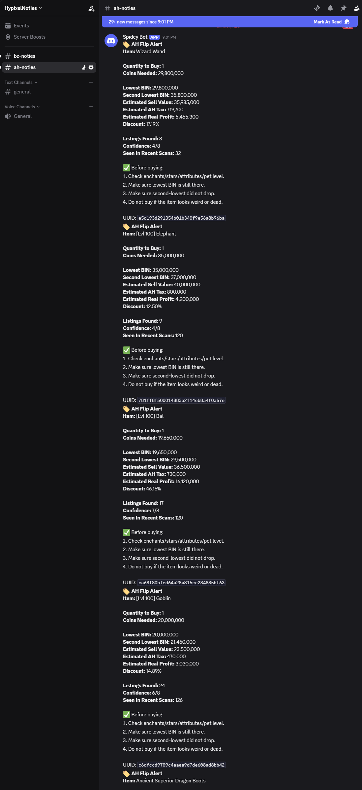

# Skyblock Bazaar Analyzer

A Raspberry Pi hosted analytics platform for Hypixel SkyBlock Bazaar trading.

## Screenshots

### Discord Alerts

## Features

- Collects live Bazaar market data using the Hypixel API
- Stores historical data in SQLite
- Analyzes profit margins and market trends
- Flask web dashboard for viewing opportunities
- Discord alerts for high-profit flips
- Runs 24/7 on a Raspberry Pi

## Technologies

- Python
- Flask
- SQLite
- Raspberry Pi
- Docker
- Discord Webhooks
- Hypixel API

## Screenshots

(Add screenshots later)

## Future Improvements

- Machine learning price predictions
- Advanced market manipulation detection
- User watchlists
- Historical profit tracking

## Disclaimer

This project is for educational purposes and is not affiliated with Hypixel.
